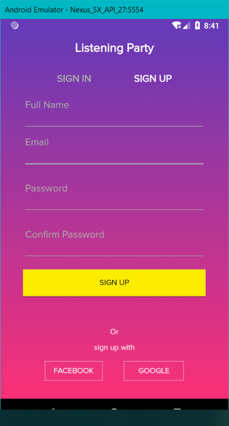
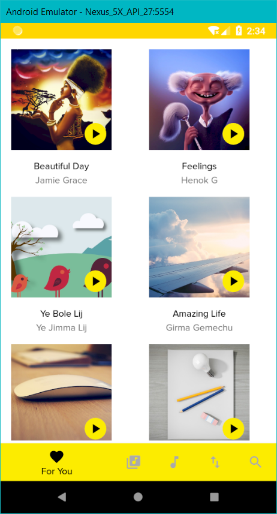
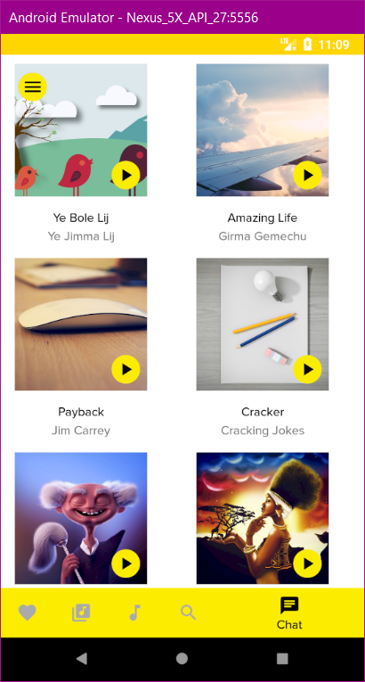
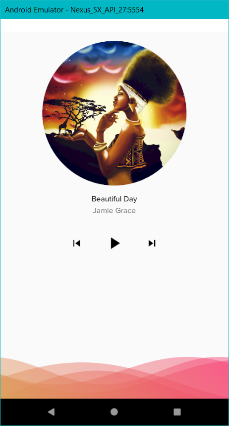
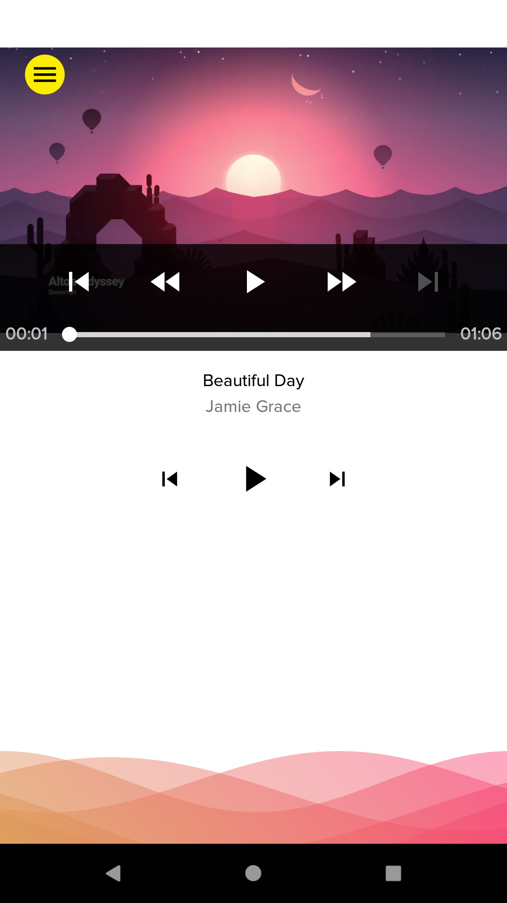

# listening-party

An android native app that lets users listen(in groups), share and publish music

## Tech Stack?

* Java
* ButterKnife
* AudioVisualizer
* ExoPlayer

#### Android Architecture Components

* LifeCycleManagement
#### Network
* Retrofit [with GSON]
* Glide
#### Database

* [ObjectBox](https://objectbox.io/)

#### 

## How Does It Look?

### LOGIN

## SIGNUP

### MUSIC

### Music Player

### Video Player

